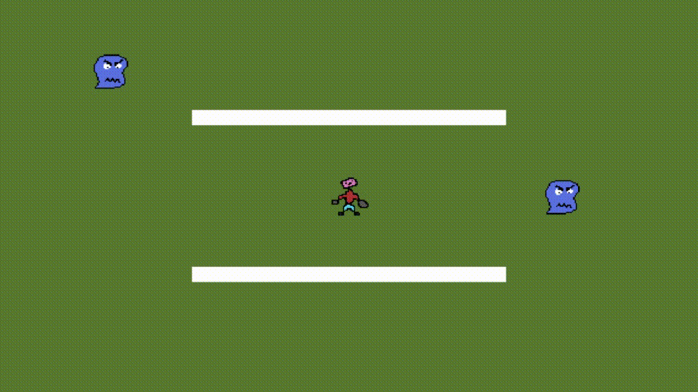

# UnityRpgOverworldBattleExample
A minimalist example of how to transition back and forth between an overworld state and a battle state and persist basic character information.

## Running the example
To run the example, open the Overworld scene and hit play.
